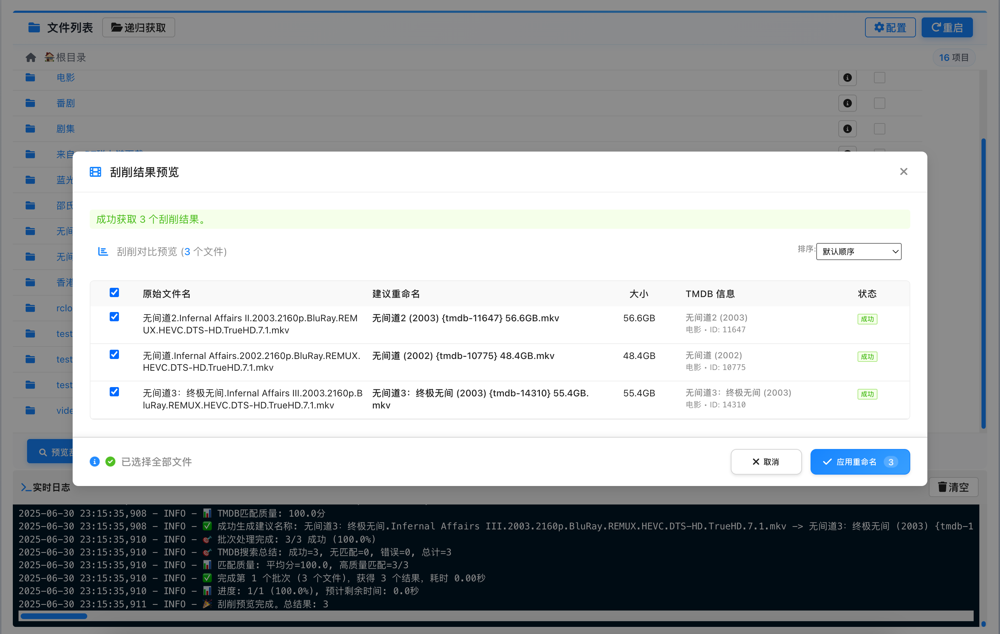
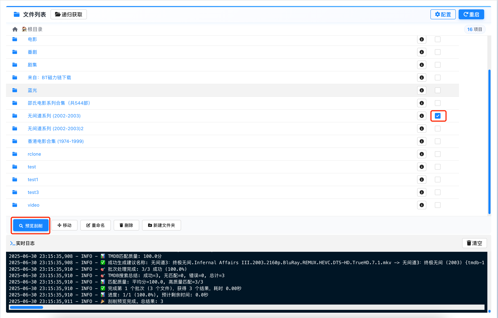
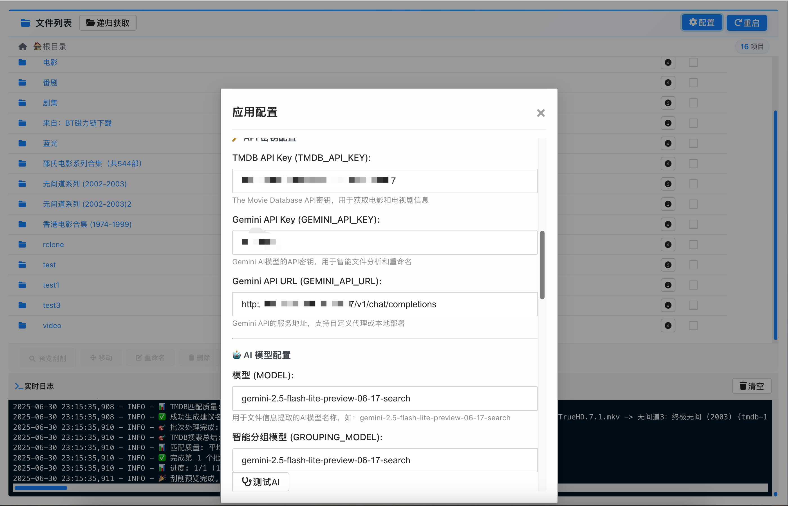
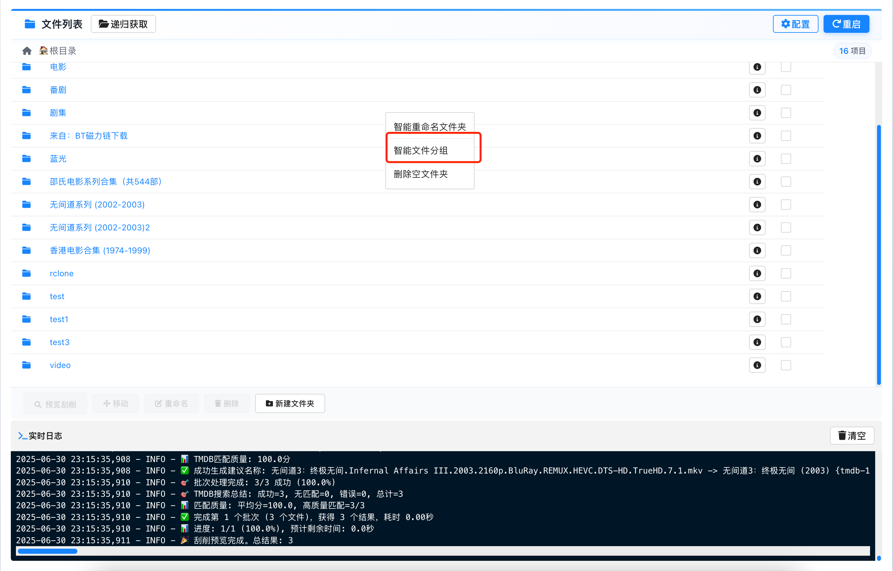
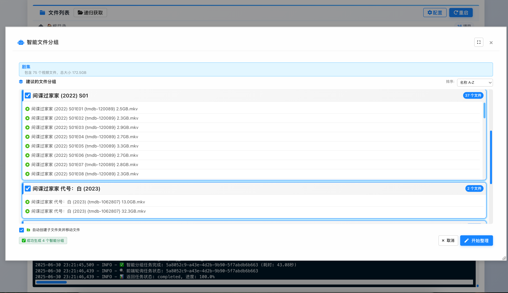
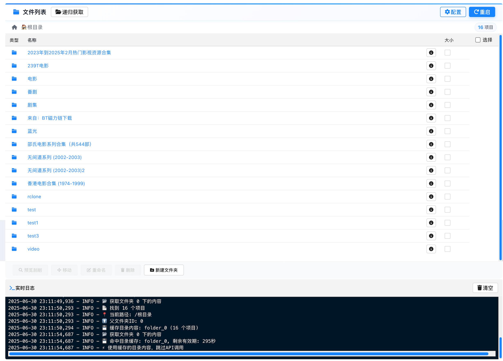

# Pan123 Scraper

一个功能强大的123云盘智能文件管理工具，集成AI智能分组、TMDB刮削、智能重命名等功能。








## 🌟 主要功能

### 🌟 核心功能

- **📁 智能文件管理**: AI自动分组、批量操作、文件夹浏览
- **🎬 媒体刮削**: TMDB集成、智能重命名、多媒体类型支持
- **🤖 AI增强**: 智能分析、自动分类、文件夹命名建议
- **⚡ 高性能**: 多线程并发、智能缓存、QPS控制
- **🔧 系统管理**: 端口管理、热重启、任务队列、详细日志


## 🚀 快速开始

### 环境要求
- Python 3.8+、123云盘API权限、TMDB API密钥、AI API服务
- 支持 Windows 10+/macOS 10.14+/Linux

### 快速安装

**方式一：预编译版本**
1. 从 [Releases](https://github.com/jonntd/pan123-scraper/releases) 下载对应平台的可执行文件
2. 运行程序，访问 http://localhost:5001

**方式二：源码运行**
```bash
git clone https://github.com/jonntd/pan123-scraper.git
cd pan123-scraper
pip install -r requirements.txt
cp config.json.example config.json
# 编辑 config.json 配置文件
python app.py
```

## ⚙️ 配置说明

启动应用后在Web界面配置以下API密钥：

```json
{
  "CLIENT_ID": "123云盘CLIENT_ID",
  "CLIENT_SECRET": "123云盘CLIENT_SECRET",
  "TMDB_API_KEY": "TMDB API密钥",
  "AI_API_KEY": "AI服务API密钥",
  "AI_API_URL": "AI服务URL（支持OpenAI兼容接口）"
}
```

### 性能配置（可选）
- **QPS_LIMIT**: API请求频率（默认12）
- **MAX_WORKERS**: 最大并发线程数（默认12）
- **MAX_SCAN_DEPTH**: 最大扫描深度（默认3层）
- **MAX_SCAN_FILES**: 最大扫描文件数（默认200个）

## 📖 使用指南

1. **启动应用**: 运行程序，访问 http://localhost:5001
2. **配置API**: 填写123云盘、TMDB、AI API密钥
3. **文件管理**: 浏览文件夹，支持批量操作
4. **智能分组**: AI自动分析文件并建议分组方案
5. **媒体刮削**: 从TMDB获取信息并智能重命名
6. **任务管理**: 查看任务队列和执行状态

## 🔧 主要API接口

- **文件管理**: `/get_folder_content`, `/move_files_direct`, `/delete_files`, `/rename_files`
- **智能功能**: `/api/grouping_task/submit`, `/scrape_preview`, `/apply_rename`
- **系统管理**: `/config`, `/restart`, `/clear_cache`, `/logs`


## 🔍 常见问题

- **端口被占用**: 应用会自动处理端口冲突
- **访问令牌过期**: 应用会自动刷新，也可手动刷新
- **AI功能不可用**: 检查AI_API_KEY和AI_API_URL配置
- **TMDB刮削失败**: 验证TMDB_API_KEY是否有效
- **任务卡住**: 在任务管理页面取消任务或重启应用
- **性能问题**: 调整MAX_WORKERS、QPS_LIMIT等配置参数

**日志查看**: `rename_log.log` 文件或Web界面"查看日志"按钮

## 🧪 开发

```bash
git clone https://github.com/jonntd/pan123-scraper.git
cd pan123-scraper
python -m venv venv
source venv/bin/activate  # Linux/macOS 或 venv\Scripts\activate (Windows)
pip install -r requirements.txt
python app.py
```

**构建**: `./build.sh` (Linux/macOS) 或 `build.bat` (Windows)
**测试**: `python test_improvements.py`


## 🔒 安全说明

- 所有配置和令牌信息存储在本地
- 应用不会上传或泄露文件内容
- 建议在内网环境使用

## 📄 许可证

MIT许可证 - 查看 [LICENSE](LICENSE) 文件了解详情。

## 📞 支持

- [GitHub Issues](https://github.com/jonntd/pan123-scraper/issues) - 问题报告
- [GitHub Discussions](https://github.com/jonntd/pan123-scraper/discussions) - 功能建议

---

⭐ **如果这个项目对你有帮助，请给个Star支持一下！**

